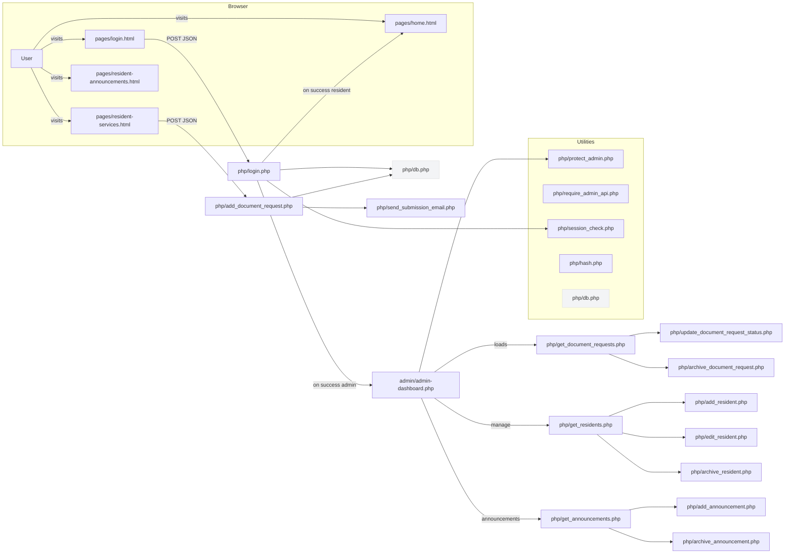

# Project Flowchart

Below is a high-level program flowchart (Mermaid) for the codebase. Open this file in VS Code to render the diagram.

**Notes:**
- This diagram is intentionally high-level. It highlights primary web pages and corresponding PHP endpoints (auth, resident management, document requests, announcements).
- If you want a PNG/SVG export, or a more detailed sub-flow for any area (authentication, document request lifecycle, admin-resident CRUD), tell me which area to expand.
